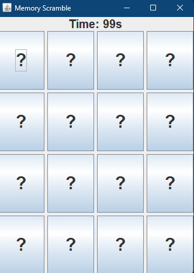
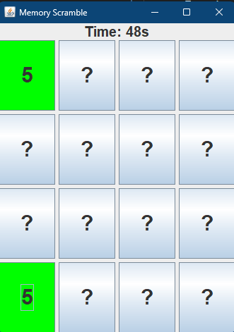
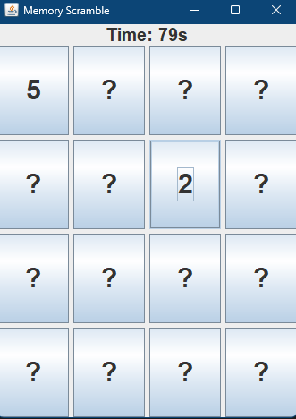
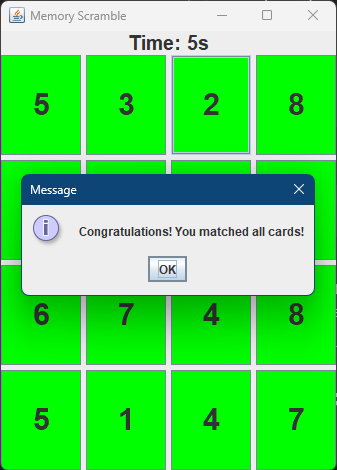
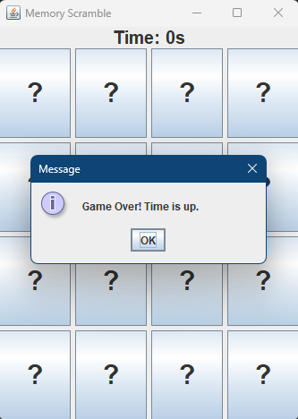

# Memory Scramble Game

## Overview

Memory Scramble is a Java Swing-based game where the player flips cards and tries to find matching pairs before the countdown timer reaches zero.

The player can configure:

- Number of rows
- Number of columns
- Timeout value

Features:

- Random card generation
- Countdown timer
- Match detection
- Win message
- Game over message

---

## Requirements

Before running the project, install:

- Java JDK 17 or later
- IntelliJ IDEA / Eclipse / VS Code (optional)

Verify Java installation:

```bash
java -version
```

Expected output:

```bash
java version "17"
```

---

## Project Structure

```text
src
├── logic
│   └── GameManager.java
│
├── model
│   └── GameSettings.java
│
├── ui
│   ├── CardButton.java
│   └── MemoryScramble.java
│
├── util
│   └── ValidationUtil.java
│
└── MemoryScrambler.java
```

---

## Build Instructions

Open a terminal in the project root directory.

Compile all Java files:

Linux:
```bash
javac -d out src/**/*.java
```
Windows:
```bash
javac -d out (Get-ChildItem -Recurse -Path src -Filter *.java).FullName
```
This command creates compiled files inside the `out` folder.

---

## Execute the Game

Run:
```bash
java -cp out MemoryScrambler
```
Or run directly from your IDE:
### IntelliJ
1. Open project
2. Locate:
```text
MemoryScrambler.java
```
3. Right-click
4. Select **Run MemoryScrambler**
---
## Game Instructions

1. Run the application

2. Enter:
    - Number of rows
    - Number of columns
    - Timeout value

3. Important:
    - The total number of cells (`rows × columns`) must be an even number.
    - This is required so every card has a matching pair.

   Examples:

   Valid:
   ```text
   4 rows × 4 columns = 16 cells
   2 rows × 6 columns = 12 cells
   ```
   Invalid:
   ```text
   3 rows × 3 columns = 9 cells
   ```
4. Click cards to reveal them
5. Match identical cards
6. Match all cards before the timer reaches zero
---
## Screenshots

### Enter Rows

---

### Enter Columns

---

### Enter Timeout Value

---

### Initial Game Board

---

### Matched Cards Example

---

### Non-Matching Cards Example

---

### Win Message

---

### Timeout Message

## GitHub Repository
Repository link:
```text
https://github.com/JonathanGhaly/Memory-Scrammble
```